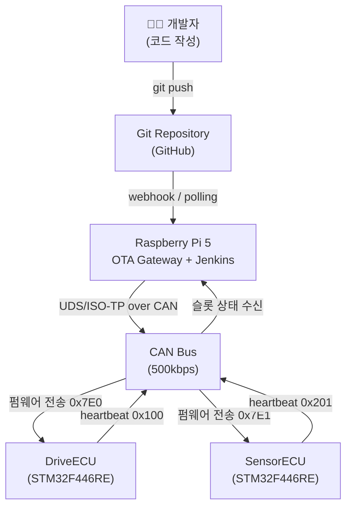
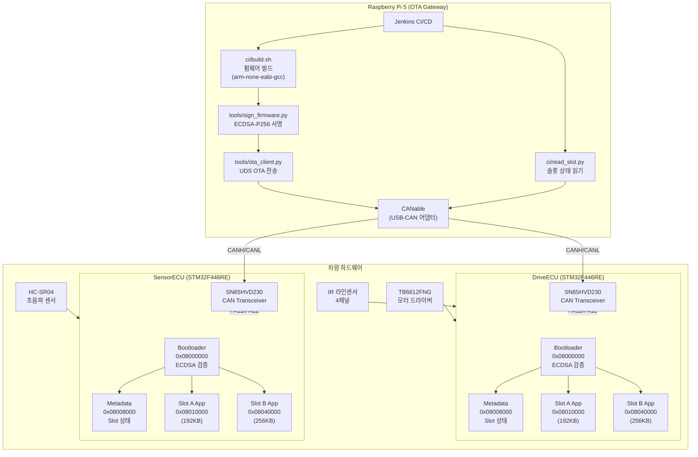
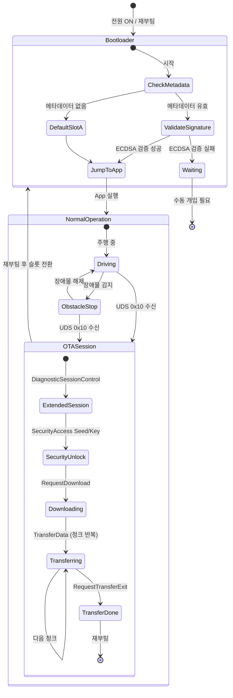
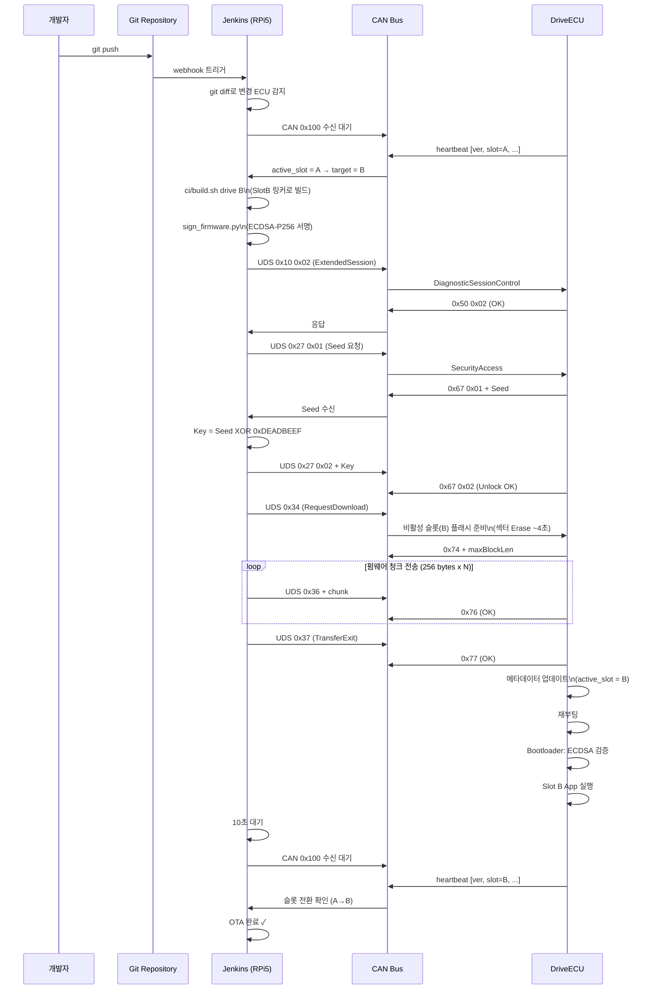

# Automotive Secure OTA 시스템 다이어그램

---

## 1. Context Diagram (컨텍스트 다이어그램)

시스템과 외부 행위자 간의 관계를 나타냅니다.

---

## 2. Block Diagram (블록 다이어그램)

시스템 내부 구성 요소와 연결 구조를 나타냅니다.

---

## 3. State Diagram (상태 다이어그램)

ECU의 부트로더 및 OTA 세션 상태 전이를 나타냅니다.

---

## 4. Sequence Diagram (시퀀스 다이어그램)

git push부터 OTA 완료까지 전체 흐름을 나타냅니다.

